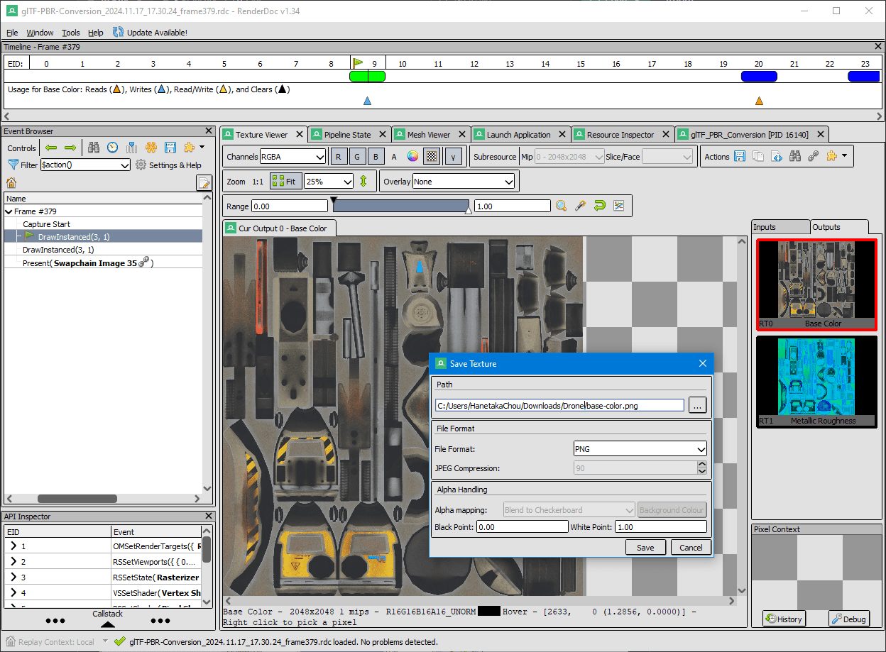

# PBR Conversion  

  

[glTF PBR Conversion - Three JS](https://github.com/KhronosGroup/glTF/tree/main/extensions/2.0/Archived/KHR_materials_pbrSpecularGlossiness/examples/convert-between-workflows)  

[glTF PBR Conversion - Babylon JS](https://github.com/KhronosGroup/glTF/tree/main/extensions/2.0/Archived/KHR_materials_pbrSpecularGlossiness/examples/convert-between-workflows-bjs)  

  
